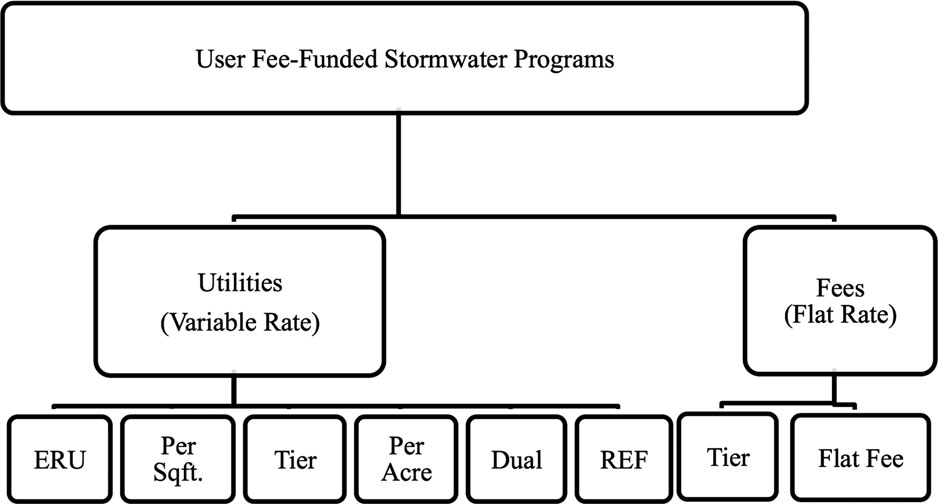

# US_stormwater_fee
A map of US stormwater utilities that collect ERU-based stormwater fees

**link to the map: https://ywpro.github.io/US_stormwater_fee/**

## Data Source 

Data is take from the [report above](https://digitalcommons.wku.edu/seas_faculty_pubs). This study by Campbell & Bradshaw (2021) identified 1851 U.S. stormwater utilities primarily through internet searches. Although the actual number of stormwater utilities could exceed 2000 as suggested by the authors, this data is helpful in estimating the cost related to stormwater management.

The original data in CSV format can be downloaded from this repository. `CampbellBradshaw_map.csv` is the one represented in the map. `CampbellBradshaw_geocoded_validated.csv` is the complete version containing all 1851 utilities.

#### Georeferencing
All locations are first geocoded with [Geocodio](https://www.geocod.io/) and then with [Google Maps](https://www.google.com/maps). Locations where two sets of coordinates differ greatly (x or y differs by larger than 0.2 degree) are manually checked. The coordinates represent the approximate center location of each stormwater utility. 

## Mapped information
This map includes 1094 stormwater utilities that charges a stormwater fee in an Equivalent Residential Unit (ERU) System or a Tier System. 

- ERU is the average or median impervious area of a single family residential property. An ERU System charges residential properties at a unit rate, and charges nonresidential properties based on the number of ERU on those properties. It's the most popular system in the U.S.;
- Tier System changes both residential and nonresidential properties based on impervious area. It's the second most popular system in the U.S.

Other charging systems are represented in the following figure (Kea et al., 2016).

  

You can click on each utility to view its location, ERU area in sqft, and per-ERU fee in U.S. dollar. Circle size represents stormwater fee magnitude. You can switch to another base map on the top-right corner.

# Reference

Campbell, W., & Bradshaw, J. (2021). Western Kentucky University Stormwater Utility Survey 2021.

Kea, K., Dymond, R., & Campbell, W. (2016). An analysis of patterns and trends in United States stormwater utility systems. JAWRA Journal of the American Water Resources Association, 52(6), 1433-1449.
